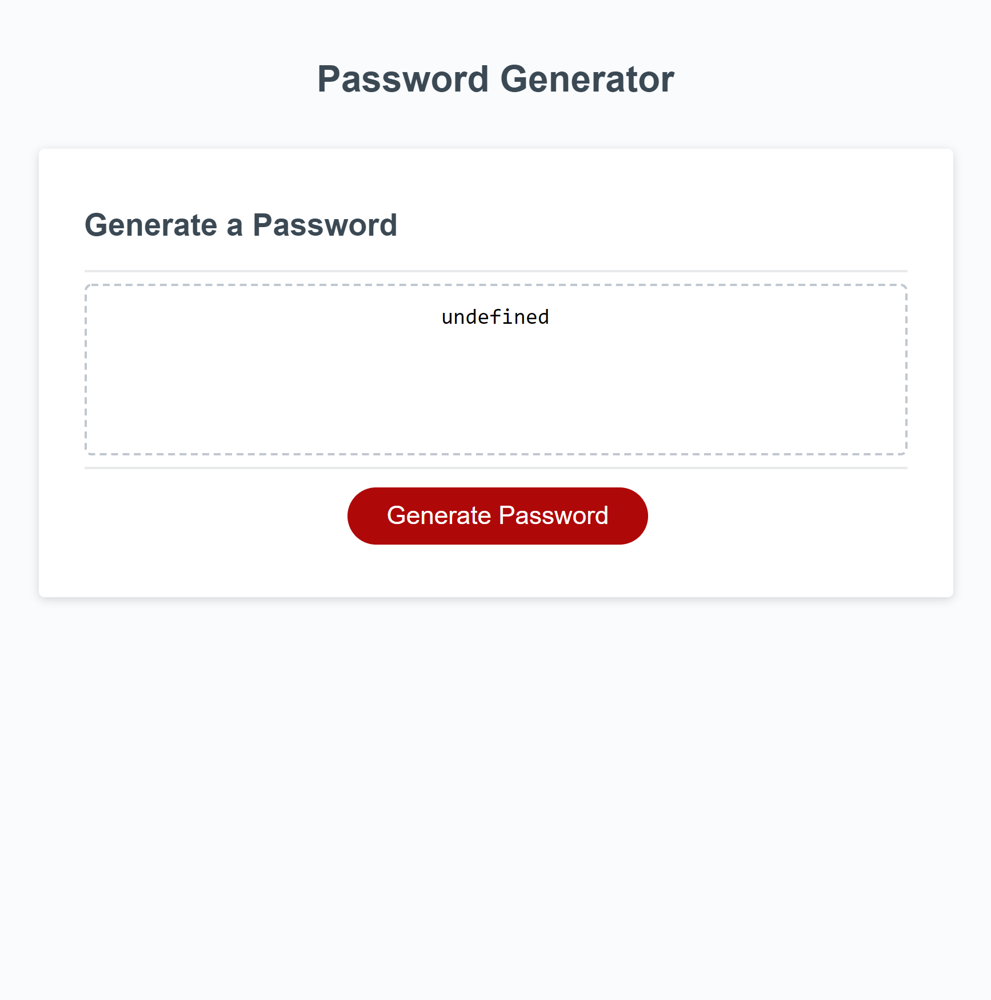

# unitThreePassordGenerator

 [Here is a link to the deployed page](https://amber-robeck.github.io/unitThreePassordGenerator/ "Password generator")

 ## Password Generator
 ---
 
 ### Are you tired of trying to come up with passwords that meet the requirements of certain applications? ***Yes you say?*** GREAT! I've got just the thing for you, it's a password generator. 👏 No need for the applause folks I'm just doing my job.
---
 #### On this website you will find
 * Perfectly functioning code
 * An endless sea of randomly generated passwords
 * The option to choose the amount of characters in your password
    * No catch I promise! Oh ok, you can only choose between 8 and 128.
* The option to choose between uppercase, lowercase, special characters and you guessed it-numbers for your password (I can feel your excitement through the screen!)
    * Don't worry now guys if you forget to pick at least one of the character sets a ***friendly*** message will pop up to let you know you need some characters to create a password.

---
This project was created for school, I myself only ended up modifying the script.js file to ensure the functional side of the page was just that-functioning. The HTML and CSS pages were already finished. THANK GOODNESS!

